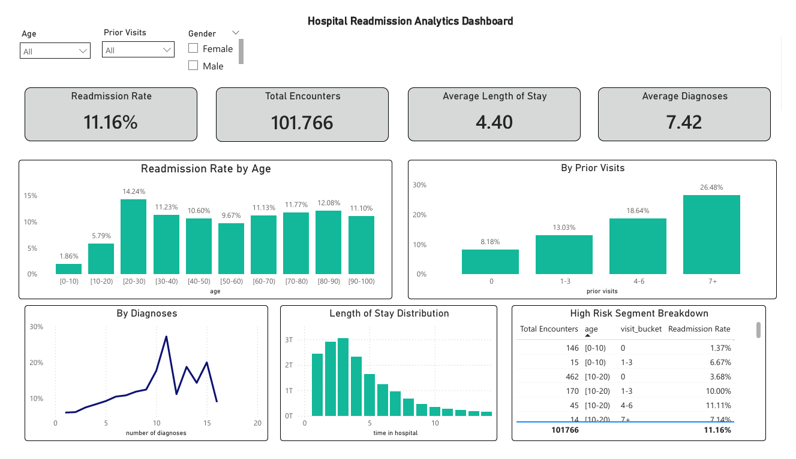

# 🏥 Hospital 30-Day Readmission Risk Analysis

## 📌 Project Overview

This project analyzes 100,000+ hospital encounters to identify key drivers of 30-day hospital readmission risk. Using PostgreSQL for data transformation and Python for exploratory data analysis, the objective is to uncover actionable insights that could support hospital discharge planning and reduce preventable readmissions.

The analysis focuses on utilization patterns, clinical complexity, and demographic trends to determine which patient segments face elevated readmission risk.

---

## 🎯 Business Objective

Hospital readmissions within 30 days are costly and often used as a healthcare quality metric.

This project aims to:

- Quantify overall 30-day readmission rate
- Identify high-risk patient segments
- Analyze how prior utilization and clinical burden impact readmission
- Provide structured insights for operational intervention

---

## 🗂️ Dataset

- ~102,000 hospital encounters
- Structured healthcare dataset
- Binary target variable:
  - `1` → Readmitted within 30 days (`<30`)
  - `0` → Not readmitted within 30 days

### Key Variables:
- `time_in_hospital`
- `number_outpatient`
- `number_emergency`
- `number_inpatient`
- `number_diagnoses`
- `age`
- `race`
- `gender`

---

## 🛠️ Tech Stack

- **PostgreSQL** – Data storage and feature engineering  
- **SQL** – KPI computation and transformation  
- **Python (Pandas, Matplotlib)** – Exploratory Data Analysis  
- **Environment Variables (.env)** – Secure database connection handling  

---

## 🧱 Data Pipeline

1. Raw healthcare CSV imported into PostgreSQL staging table  
2. Feature engineering performed in SQL:
   - Created `total_prior_visits`
   - Bucketed visit frequency (`0`, `1-3`, `4-6`, `7+`)
   - Created binary readmission target (`readmitted_binary`)
3. Clean modeling dataset extracted into Python for analysis  

---

## 📊 Key Findings

### 🔹 Overall Readmission Rate
**11.16%** of hospital encounters resulted in 30-day readmission.

---

### 🔹 Prior Healthcare Utilization is the Strongest Driver

Patients with:

- **0 prior visits** → ~8% readmission rate  
- **7+ prior visits** → ~26% readmission rate  

High-utilization patients face more than **3x baseline risk**, making prior visits the strongest observable predictor of readmission.

---

### 🔹 Clinical Complexity Increases Risk

Readmission rates increase steadily as the number of diagnoses increases, indicating that patients with higher comorbidity burden are significantly more likely to return within 30 days.

---

### 🔹 Age Effects Are Moderate

Readmission rates rise after childhood and remain relatively stable across adult age groups (~10–12%), suggesting that age alone is not the dominant driver compared to utilization or diagnosis count.

---

## 🧠 Analytical Approach

The analysis followed a structured workflow:

1. SQL-based feature engineering  
2. Exploratory Data Analysis (EDA)  
3. Risk segmentation of high-utilization groups  
4. KPI development for operational reporting  

The focus was interpretability and actionable insight rather than purely predictive modeling.
---

## 🚀 Next Steps

- Build an interactive executive dashboard  
- Add deeper segmentation analysis  
- Incorporate medication and lab result variables  
- Evaluate cost impact of high-risk segments  

---

## 📊 Dashboard

An interactive Power BI dashboard was built to explore hospital readmission patterns and identify high-risk patient segments.

### Key Metrics
- Readmission Rate: 11.16%
- Total Encounters: 101,766
- Avg Length of Stay: 4.40 days
- Avg Diagnoses: 7.42

### Key Insights
- Readmission risk increases significantly with prior visits (up to ~26% for 7+ visits)
- Patients aged 20–30 show the highest readmission rates (~14%)
- Higher number of diagnoses correlates with increased readmission risk
- Most hospital stays fall within 2–5 days

### Dashboard Features
- Interactive slicers (Age, Prior Visits, Gender)
- KPI summary cards
- Readmission trends by age, visits, and diagnoses
- Length of stay distribution
- High-risk segment breakdown table

### Preview

## 📈 Why This Project Matters

Hospital readmissions are a major cost driver in healthcare systems. By identifying high-risk utilization and complexity patterns, healthcare providers can:

- Improve discharge planning  
- Allocate follow-up resources efficiently  
- Reduce preventable readmissions  
- Improve quality performance metrics  

---

## 👤 Author

Shawn Malal  
Data Analytics | SQL | Python | Business Intelligence